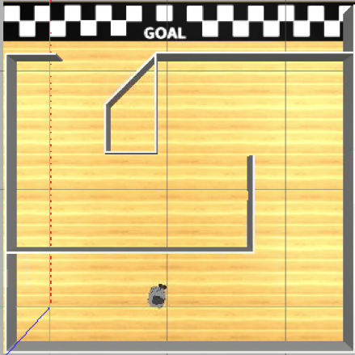

# Meiro Runner - Escape from a maze world by training a reinforcement learning model on AWS RoboMaker

Technologies for autonomous robots and self-driving cars have been rapidly advancing. Their development often relies on building application-specific simulation environments, and using the information to train reinforcement learning (RL) models. 

The following figure (a screenshot from Gazebo) shows you a simulation environment on AWS RoboMaker. This sample robot operating system (ROS) app sets up the environment where an agent is placed in a simple maze. Some of you might be curious about what meiro means? Meiro stands for a maze in Japanese.



An RL algorithm will help navigate the agent to reach to the GOAL without bumping into a wall. The agent has a 360-degree surround lidar scanner (360 points x 5 fps) so that it monitors the distance from the surrounding walls all around. The lidar data are used to describe a state at a given step within an episode. The agent makes a decision out of 5 different actions i.e. turn left, turn right, move straight, steer to the left, and steer to the right. (To learn more about the reinforcement learning framework used for this application, Coach, please take a look at the following [link](https://github.com/NervanaSystems/coach))  

## Preparation

This sample application is expected to be executed from [AWS RoboMaker](https://aws.amazon.com/robomaker/).

On [AWS RoboMaker development environment](https://console.aws.amazon.com/robomaker/home#ides), execute following commands to prepare the environment (Kinetic and Melodic are supported).

```
cd ~/environment
git clone https://github.com/aws-samples/aws-robomaker-sample-application-meirorunner.git  MeiroRunner
cd MeiroRunner
./ws_setup.sh
```

The setup script will create AWS resources to run the application and the created resources are noted in ws_settings.yaml file.
The setup script will then build the application, the whole process will take around 20 minitue to complete.

## How to run application on AWS RoboMaker Simulation

- To train machine learning model with reinforcement learning using robomaker simulation, execute following command in the terminal window:

    ```bash
    cd ~/environment/MeiroRunner
    ./app_launcher.sh
    ```

   (The script file app_launcher.sh is created when you executed ./ws_setup.sh)

- To evaluate the machine learning model using robomaker simulation, execute following command in the terminal window:

    ```bash
    cd ~/environment/MeiroRunner
    ./app_launcher_evaluate.sh
    ```

  (The script file app_launcher.sh is created when you executed ./ws_setup.sh)

## How to modify application

To modify and rebuild the application, modify the code on AWS RoboMaker development environment and execute following:

- If you change the file under simulation_ws
    ```bash
    cd ~/environment/MeiroRunner/simulation_ws
    colcon build
    colcon bundle
    ```

- If you change the file under robot_ws
    ```bash
    cd ~/environment/MeiroRunner/robot_ws
    colcon build
    colcon bundle
    ```

To run the machine learning model in the real-life using a physical robot (i.e. Turtlebot3 Burger), you can use a launch file bringup_robot.launch in meiro_runner_robot package.
The robot application is under robot_ws direcotry, to build and deploy the application to physical robots, please refer to [RoboMaker documentation](https://docs.aws.amazon.com/robomaker/latest/dg/gs-deploy.html).
Following is the configuration for robot application running in Turtlebot3 Burger.

- Package name: meiro_runner_robot
- Launch file: bringup_robot.launch
- Environment variables:
    -  MARKOV_PRESET_FILE: meiro_runner.py
    - MODEL_FILE: model/model.pb
    - MODEL_S3_PREFIX: model-store
    - ROS_AWS_REGION: <copy the value of *aws_region* from ws_setting.yaml>
    - MODEL_S3_BUCKET: <copy the value of *bucket_name* from ws_setting.yaml> 

## License

This library is licensed under the MIT-0 License. See the LICENSE file.
